<h1 align="center">Sergio Gómez Lajos</h1>

  
  
  
  
  

## Sobre mí

Soy Técnico de Sistemas (Nivel 2). Trabajo en soporte avanzado y administración, con bastante enfoque en la automatización de tareas para ahorrar tiempo y reducir errores repetitivos. Cuando aparece una incidencia, suelo apoyarme en logs, eventos y pruebas rápidas para acotar la causa lo antes posible. Y, si compensa, intento dejarla resuelta también a través de algún script o procedimiento que permita afrontarla más rápido la próxima vez.

La mayor parte de mi trabajo está orientada a entornos Windows y PowerShell. También he desarrollado algunas aplicaciones en Python y sigo aprendiendo desarrollo para crear herramientas algo más completas cuando la situación lo requiere.

Desarrollo proyectos y utilidades propias enfocadas al soporte técnico, la administración de sistemas y la automatización de tareas, especialmente en entornos Windows. Mi objetivo es crear soluciones prácticas que ayuden a agilizar procesos, reducir errores repetitivos y facilitar la resolución de incidencias en el día a día.

Los proyectos que he ido publicando siguen una línea bastante clara: detectar necesidades reales dentro del entorno técnico y convertirlas en herramientas útiles que aporten valor. Ya sea mejorando tiempos de respuesta, simplificando tareas de diagnóstico o haciendo más eficiente la operativa habitual, busco que cada solución tenga una utilidad real. En conjunto, reflejan una forma de trabajar muy centrada en la mejora continua, en la eficacia práctica de las herramientas y en desarrollar soluciones que no solo resuelvan un problema puntual, sino que también puedan reutilizarse como apoyo en futuras intervenciones.

## Trabajo

- Soporte técnico avanzado y resolución de incidencias
- Diagnóstico de DNS, red, servicios, eventos y conectividad
- Automatización y scripting con PowerShell
- Desarrollo de herramientas para soporte y administración
- Documentación técnica clara y reutilizable

## Tecnologías y herramientas

### Sistemas, soporte y administración

  
  
  
  
  
  

### Red, diagnóstico y operación

  
  
  
  
  
  

### Automatización y desarrollo

  
  
  
  
  
  
  
  

## Métricas

  

## Filosofía

Prefiero herramientas útiles, diagnósticos claros y automatizaciones que de verdad ayuden en la operativa diaria. Si una solución permite ahorrar tiempo, reducir errores y dejar una base reutilizable para futuras intervenciones, entonces ya tiene valor real.

## Contacto

- Email: `Sergio.Catoira@hotmail.com`
- [sergio-gómez-lajos](https://www.linkedin.com/in/sergio-g%C3%B3mez-lajos/) 
- [sergioportafolio.vercel.app](https://sergioportafolio.vercel.app)

